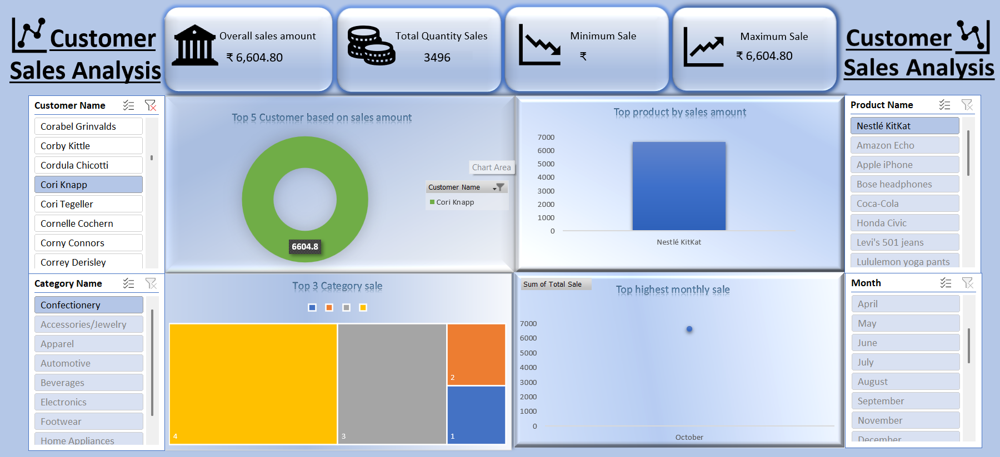
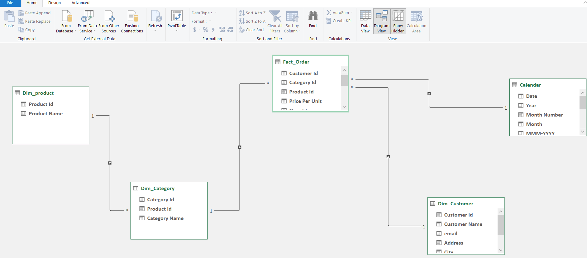
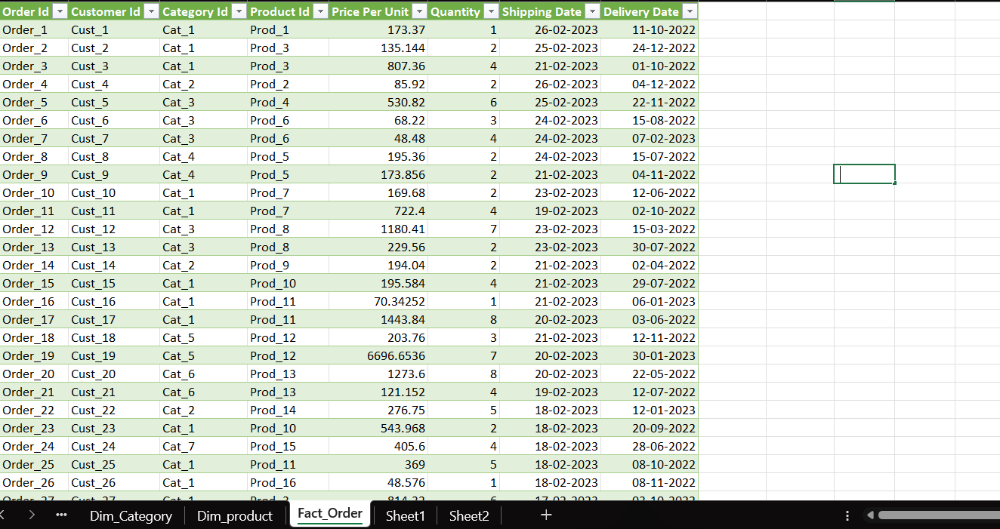

# 📊 Excel Sales Dashboard

An interactive **Sales Dashboard built in Microsoft Excel** using Pivot Tables, Power Pivot, DAX Measures, and Slicers to analyze sales performance.

---

## 🖥 Dashboard Preview

---

## 🧩 Data Model

---

## 📂 Dataset

---

## 📈 Features

* Overall Sales KPI
* Total Quantity Sold
* Minimum & Maximum Sale
* Top 5 Customers by Sales
* Top 5 Products by Sales
* Category-wise Sales
* Monthly Sales Trend
* Interactive slicers

---

## 🛠 Tools Used

* Microsoft Excel
* Pivot Tables
* Power Pivot
* DAX

---

## 👨‍💻 Author

**Pawan Rathore**

🔗 Connect With Me LinkedIn:https://www.linkedin.com/in/pawan-rathore18/

⭐ If you find this project useful, consider giving it a star on GitHub!
